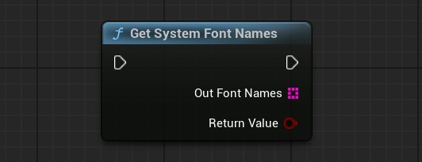
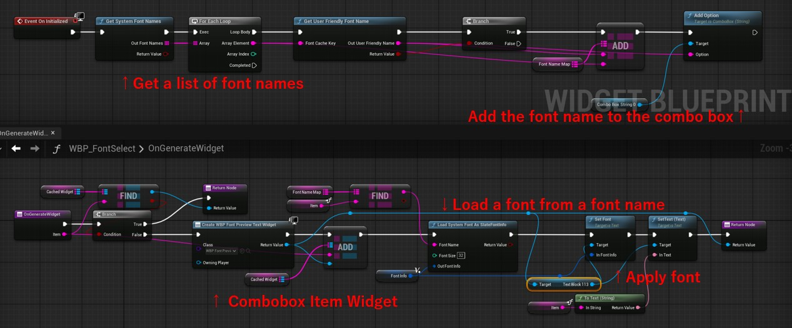

# SystemFontLoader for Unreal Engine

(Read this document in other languages: [日本語](README.ja.md)) <!-- Optional: If you plan to provide a Japanese version -->

A plugin for Unreal Engine that allows you to easily load and use fonts installed on the Windows system within your project.

## Overview

This plugin utilizes the Windows Registry and GDI API to retrieve information about system fonts and provides functions accessible from Unreal Engine Blueprints. This enables dynamic application of system fonts to UI elements and other text components at runtime.

## Features

*   **Get System Font List:** Retrieves a list of font names installed on the Windows system.
*   **Generate FSlateFontInfo:** Creates an `FSlateFontInfo` struct (usable in UMG and Slate) from a specified font name and size.
*   **Get User-Friendly Font Name:** Retrieves the common display name for a font based on its internal cache key.
*   **Font Cache:** Scans and caches system font information upon engine startup, speeding up font information retrieval during runtime.

## Supported Environments

*   **Unreal Engine:** 5.5
*   **Platform:** **Windows (64bit) only**
    *   This plugin relies heavily on Windows APIs (Registry, GDI, Shell API) and will **not** work on other platforms.

## Installation

1.  **Download from Releases:**
    *   Download the latest zip file from the [GitHub Releases page](https://github.com/yeczrtu/SystemFontLoader/releases)
2.  **Place in Project:**
    *   Extract the downloaded zip file.
    *   Copy the extracted `SystemFontLoader` folder into your Unreal Engine project's `Plugins` folder (e.g., `MyProject/Plugins/SystemFontLoader`).
    *   Create the `Plugins` folder if it doesn't exist.
3.  **Enable the Plugin:**
    *   Open the Unreal Editor and go to `Edit` > `Plugins`.
    *   Find `SystemFontLoader` under the `Installed` category or by using the search bar. Enable the checkbox next to it.
    *   Restart the editor if prompted.
4.  **(For C++ Projects) Build the Project:**
    *   If you have a C++ project, you might need to regenerate Visual Studio project files and build the solution.

## Usage

### Blueprint Functions

Once the plugin is enabled, the following functions will appear under the `System Font Loader` category in the Blueprint editor's function list:

1.  **Get System Font Names:**
    *   Retrieves a list of available system font names (internal cache keys). Typically called during application startup or when initializing a settings screen.
2.  **Get User Friendly Font Name:**
    *   Gets the display name suitable for user interfaces (like combo boxes) from the internal name obtained via `Get System Font Names`.
3.  **Load System Font As SlateFontInfo:**
    *   Generates an `FSlateFontInfo` using a font name (from `Get System Font Names`) and a desired font size.
    *   Apply the generated `FSlateFontInfo` to a `Text` Widget (or similar) using nodes like `Set Font`.

**Simple Usage Example (Widget Blueprint):**

*   Call `Get System Font Names` in the `Event Construct` to get an array of font names.
*   Loop through the array. For each name, call `Get User Friendly Font Name` to get the display name and add it to a `ComboBox String`. It's good practice to store the corresponding internal names in another array.
*   In the ComboBox's `On Selection Changed` event, get the internal name corresponding to the selected display name. Call `Load System Font As SlateFontInfo` to generate the `FSlateFontInfo`.
*   Pass the generated `FSlateFontInfo` to the `Set Font` node of a `TextBlock` or other text widget.

### Demo Level

The plugin content includes a demo level demonstrating basic usage.

*   **Location:** `SystemFontLoader Content / Demo.umap`
*   **Content:**
    *   Uses a UMG widget to display a list of system fonts in a combo box.
    *   Selecting a font in the combo box changes the font of the text block below it.

To open the demo level, you need to enable "Show Plugin Content" in the Content Browser's settings.

## Blueprint API Details

### Get System Font Names

*   **Description:** Gets the cached list of system font names. These are internal cache keys and may not always be user-friendly display names.
*   **Outputs:**
    *   `Out Font Names` (TArray<FString>): An array of system font names (cache keys).
*   **Return Value:** (Boolean): `true` if successful, `false` on failure (e.g., not on Windows, failed to get subsystem).

### Load System Font As SlateFontInfo

*   **Description:** Generates an `FSlateFontInfo` from a font name (cache key from `Get System Font Names`) and a size.
*   **Inputs:**
    *   `Font Name` (FString): The font name obtained from `Get System Font Names`.
    *   `Font Size` (Integer): The desired font size in points.
*   **Outputs:**
    *   `Out Font Info` (FSlateFontInfo): The generated `FSlateFontInfo`. Will be an empty `FSlateFontInfo` on failure.
*   **Return Value:** (Boolean): `true` if the `FSlateFontInfo` was generated successfully, `false` on failure (e.g., font not found, file doesn't exist).

### Get User Friendly Font Name

*   **Description:** Attempts to get a user-friendly display name for a given font cache key (obtained from `Get System Font Names`) using the GDI API.
*   **Inputs:**
    *   `Font Cache Key` (FString): The font name (cache key) from `Get System Font Names`.
*   **Outputs:**
    *   `Out User Friendly Name` (FString): The retrieved user-friendly font name. May be the same as the input or empty on failure.
*   **Return Value:** (Boolean): `true` if a user-friendly name was successfully retrieved, `false` otherwise.

## FAQ (Frequently Asked Questions)

**Q: Does this plugin work in packaged applications (Shipping builds)?**

A: Yes, it does.

**Q: Is it compatible with platforms other than Windows (e.g., macOS, Linux, iOS, Android)?**

A: No, it is not compatible.

**Q: If I install a new font while the application is running, will it appear in the list immediately?**

A: No, it will not. The font list cache is built when the engine (or editor) starts up. To use newly installed fonts, you need to restart the engine or the application.

**Q: Can I use this plugin for commercial projects?**

A: Yes, you can. This plugin is provided under the MIT license, allowing you to use it freely within the terms of the license.

## Notes and Limitations

*   **Windows Only:** This plugin heavily relies on Windows APIs and **will not work** on macOS, Linux, mobile platforms, etc. You will need platform checks or alternative solutions if using this in a cross-platform project.
*   **Initial Cache Build:** The plugin scans and builds the font cache when the engine (or editor) starts. Depending on the number of fonts, this might cause a slight delay on the first launch.
*   **Registry Access:** Requires read access to the Windows Registry (`HKLM\SOFTWARE\Microsoft\Windows NT\CurrentVersion\Fonts`) to retrieve font information. This is usually not an issue but might fail in environments with strict permission settings.
*   **Font File Existence:** The cache is built based on registry information. If the actual font file is missing, `Load System Font As SlateFontInfo` might succeed, but the `FSlateFontInfo` may not function correctly (resulting in a fallback font being displayed).
*   **Font Name Ambiguity:** Windows font names can be complex (e.g., "Arial Bold", "Arial Italic"). The `ExtractFontNameFromRegistryValue` function attempts to generate a base name by removing common style suffixes (Bold, Italic, TrueType, etc.). This might not produce a perfect base name for all fonts. `Get User Friendly Font Name` tries to get a more accurate display name via GDI, but this is also not guaranteed to be perfect in all cases.

## License

This plugin is released under the [MIT License](LICENSE).

## Author

[yeczrtu](https://github.com/yeczrtu)